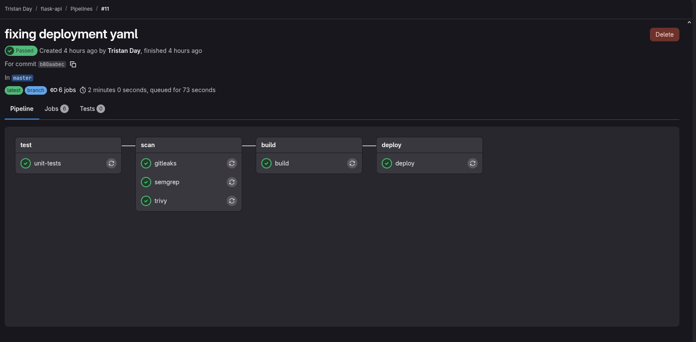

#Overview
This project displays a production-style CI/CD pipeline that I built on self-hosted infrastructure.
A Python Flask API is what is deployed but the real focus was in building this pipeline.
The pipeline utilizes unit testing, three layers of security testing (SAST [Semgrep], secrets detection [Gitleaks], and container security [Trivy]) before code can be deployed.
Once these testing and security checks pass automated build and deployment is done on a 3 node Kubernetes cluster. The focus of this project was to learn and develop hands-on experience with Gitlab Ci/CD, Kubernetes, and DevSecOps practices in a homelab environment.

## Tech Stack
Kubernetes - Container orchestration chosen over k3s or MicroK8s to try to learn Kubernetes itself deeper
Flannel - Node networking : matches kubeadm default CIDR
GitLab CE - Self-hosted Git server and CI platform
GitLab CI/CD - Pipeline definition and execution engine
GitLab Runner - Executed automated test, scan, build, deployment in isolated Docker containers
Docker - Containerizes Flask API app
Docker Compose - Orchestrates GitLab CE and Gitlab Runner on kube1 (my control plane)
Python / Flask - Deployed app
pytest - Unit testing framework
Semgrep - Static Application Security Testing for source code
Gitleaks - Checks git history looking for leaked secrets or credentials
Trivy - Scans filesystem for known CVEs before image is built
kubectl - Tool to administrate kubernetes

## Pipeline

### Stages

**test**
Runs unit tests against the Flask API using pytest. Validates that the `/health` and `/hello` endpoints return the expected status codes and JSON responses. If tests fail, the pipeline stops and nothing is scanned or deployed.

**scan**
Three security jobs run in parallel:
- **Semgrep** — static analysis of the source code, looking for security vulnerabilities and insecure coding patterns
- **Gitleaks** — scans the git history for accidentally committed secrets, API keys, or credentials
- **Trivy** — scans the filesystem for known CVEs rated HIGH or CRITICAL. Pipeline fails if any are found.

**build**
Builds a Docker image from the Flask app using Docker-in-Docker and pushes it to the self-hosted GitLab Container Registry. The image is tagged with the commit SHA (`$CI_COMMIT_SHORT_SHA`) so every build is uniquely traceable back to a specific commit.

**deploy**
Applies the Kubernetes manifests to the `flask-app` namespace using a dedicated service account with least-privilege RBAC permissions. Updates the deployment with the new image tag and waits for the rollout to complete successfully. Only runs on the `master` branch.
